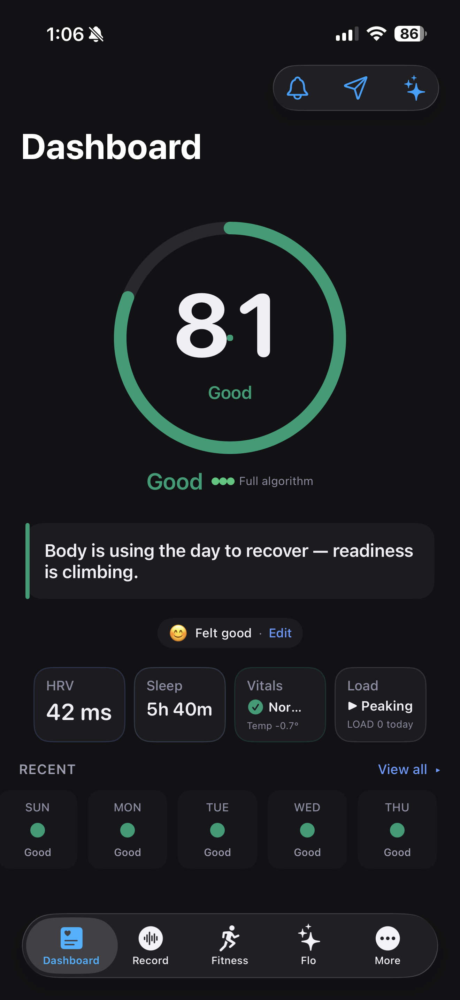
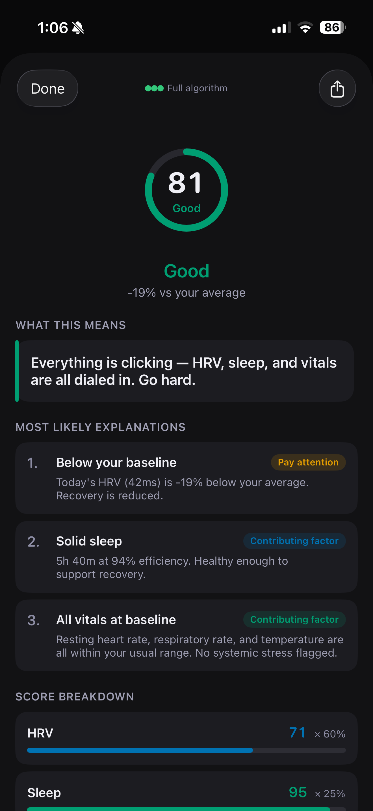
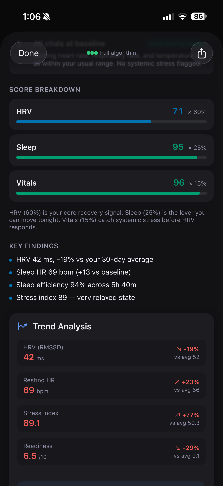
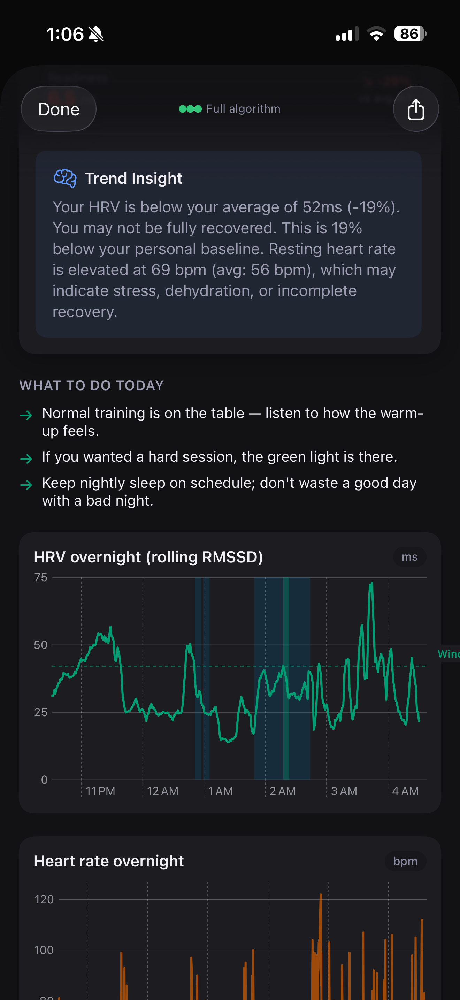
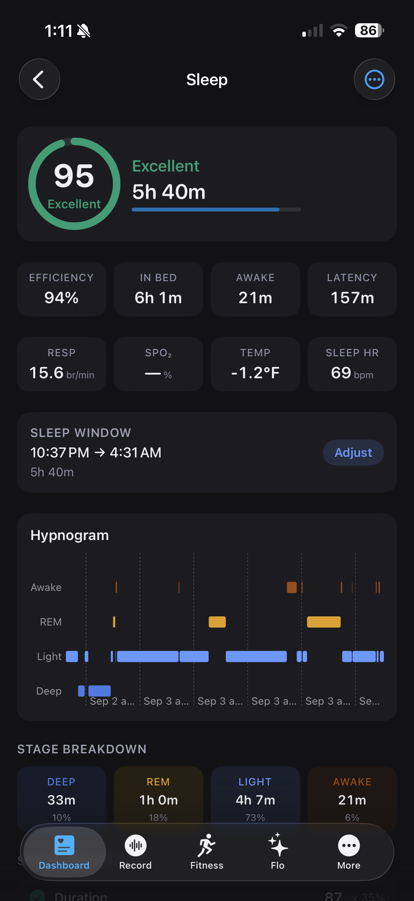
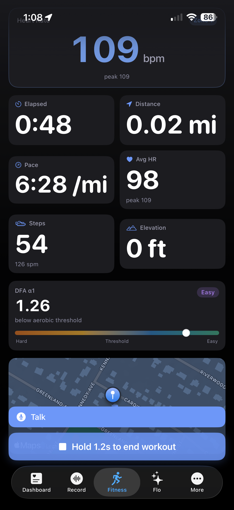
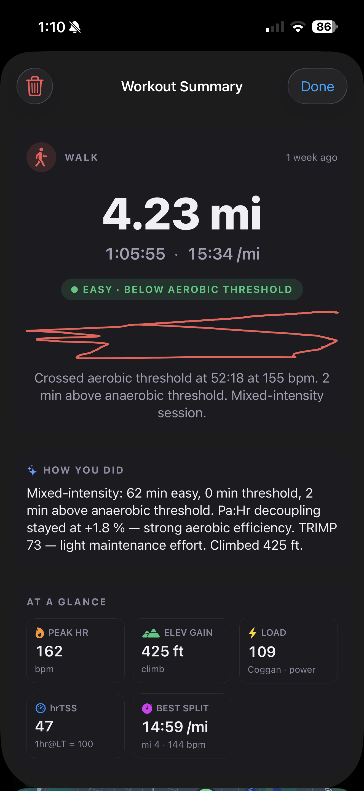
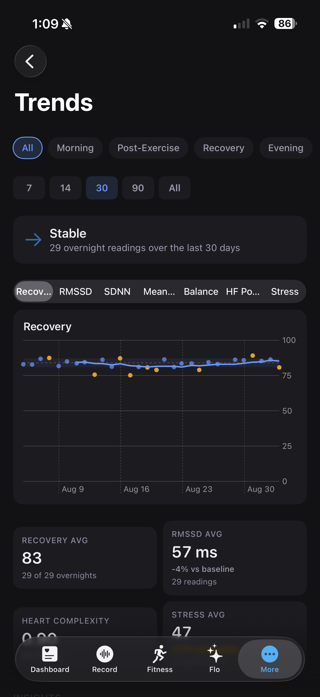
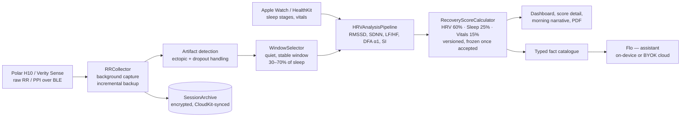

# Emuqu

Emuqu is an iOS app that measures recovery from raw heart-beat intervals. It
records every beat from a Polar chest strap or armband through the night and
during training, scores the night against your own baseline, and explains the
score in plain language. It reports only what it measured.

[](https://github.com/chrissharp80/emuqu/actions/workflows/gates.yml)


$9.99 once, after a 7-day trial. No subscription.

<p align="center">
  
  
  
  
</p>
<p align="center">
  
  
  
  
</p>

## What it does

Three things, in one binary.

1. **Overnight recovery.** A Polar H10 or Verity Sense records raw RR or PPI
   intervals all night. The app finds a quiet, stable window in the sleep,
   scores it against up to 60 days of your own data, and freezes the result.
   This is the core of the app and the part with the most protection around
   it.
2. **Workouts and sensors.** Ten sports across Polar straps, Apple Watch, Stryd
   foot pods, FTMS trainers and the Concept2 PM5, with GPS routes, splits,
   power, live DFA alpha-1, trail navigation, an offline trail back to where
   you started, and PDF reports. Training load from workouts feeds the readiness gauge.
3. **An assistant that only knows your data.** Apple Intelligence on the
   device, or your own API key for Claude, ChatGPT, Gemini, Grok or DeepSeek.
   It answers from a typed catalogue of facts built from your measurements and
   declines medical questions instead of guessing.

It is not a training-plan generator, not an injury predictor and not a medical
device. The acute:chronic load ratio is shown as context and kept out of the
recovery score on purpose.

The complete feature list is in [`docs/FEATURES.md`](docs/FEATURES.md).

## The hard parts

- **The signal.** A night is more than 20,000 beats with ectopics, strap
  dropouts and position changes in it. Artifact detection, window selection
  and the DFA alpha-1 fit all have to be right before a score means anything.
  The time-domain arithmetic is checked against PhysioNet reference
  recordings ([`docs/hrv-reference-data.md`](docs/hrv-reference-data.md));
  artifact handling, window selection and the DFA fit are covered by unit
  tests on synthetic and recorded series.
- **Honesty about the number.** No wearable's composite recovery score has
  been validated against outcomes, and the app says so. Scoring is versioned
  (`v2.may2026`), the version is printed on every score, and every heuristic
  is listed with its evidence status in
  [`Tools/science_register/register.json`](Tools/science_register/register.json).
- **Copy that matches code.** A metric's meaning is written in the score view,
  the help centre, the assistant's fact catalogue, the PDF report and the
  docs. A copy linter and a perimeter check keep the medical vocabulary
  identical across all of them, in 17 languages.
- **Running all night on a phone.** Background Bluetooth capture with
  incremental backup, recovery from the strap's own memory after a crash, and
  CloudKit sync that never touches the main thread.

## How it is built

The repository is set up so that a regression cannot land quietly.

- **Forty-one scripted gates** run in `make ci`: copy perimeter, science
  register, scoring governance (the constants hash is tied to the version
  string), localization coverage, orphans and resolution, SBOM drift,
  declaration length and type size limits, `try?` on write paths, singleton
  and legacy-observable counts, and more. Every budget ratchets in one
  direction ([ADR 004](docs/adr/004-ratcheted-budgets.md)).
- **The gates are tested.** One script plants a violation for each gate and
  proves it goes red. Another proves each gate fails closed on a missing
  input. A third proves each is wired into CI.
- **Tests.** 2,770 unit tests and 88 UI tests, including snapshot tests for
  the score views, characterization tests for the collector's observable
  surface, and negative tests for the gates. Coverage floors are measured and
  ratcheted, and are never restated in prose, so they cannot drift.
- **Strict build.** Warnings are errors. The project builds in Swift 6
  language mode with complete strict concurrency. There is no `try!`, `as!`,
  `fatalError`, force-unwrap, `TODO` or `FIXME` in the app's 213,000 lines;
  two `preconditionFailure` calls guard hard-coded literals at startup.
- **Ship hygiene.** Privacy manifest, purpose strings for every entitlement,
  API keys in the Keychain and never in iCloud, GitHub Actions pinned to
  commit SHAs, an SBOM for the eleven Swift packages, CodeQL, and a costed CI
  posture ([`docs/CI_POSTURE.md`](docs/CI_POSTURE.md)).
- **Checked documentation.** File counts in the maintainers guide, relative
  links and cited paths are verified by gates.

## How a night becomes a score



The window-selection heuristics are the app's own. The artifact handling, the
baseline model (ln RMSSD against a personal SD band) and the DFA alpha-1
thresholds follow the literature cited in the help centre. The science
register and Settings → About → "How Emuqu scores recovery" say which is which.

## Requirements

### Hardware

- **Polar H10** chest strap or **Polar Verity Sense** optical armband. The app
  reads raw RR or PPI intervals from Polar devices over Bluetooth and has no
  HRV function without one.
- **Apple Watch**, recommended. Sleep stages and duration come from HealthKit
  when a Watch is present, and its passive heart rate is used to detect and
  merge sleep after the strap comes off. Without a Watch, sleep stages are
  classified from the strap's own RR data.

### Software

- **iOS 17.0** or later for the app, every sensor integration, the scoring,
  and the bring-your-own-key AI providers.
- **iOS 18.0** or later for on-device translation of the narrative text.
  Earlier versions show the narratives in English.
- **iOS 26.0** or later for the Apple Intelligence provider, which is free and
  on-device. On iOS 17 to 25 the assistant works with your own API key.
- **HealthKit** access for sleep, workouts and vitals.

## Technical notes

- **SwiftUI and Swift Concurrency** throughout. The collector is split into
  narrow observable signals so views re-render only for the state they use.
- **Polar BLE SDK** for raw RR and PPI, direct Bluetooth for Stryd, FTMS
  trainers and the Concept2 PM5, and optional heart-rate and power
  broadcasting to trainer apps.
- **HealthKit** for sleep stages, respiratory rate, SpO₂, wrist temperature
  and workouts, with bounded queries and guards against eager prompts.
- **On-device frameworks**: Foundation Models for the assistant, Speech for
  dictation, Translation for the narratives.
- **Streaming HTTP and SSE** clients for the five cloud providers, with prompt
  caching and a deterministic intent shortcut in front of the model.
- **Storage**: an encrypted session archive, streamed raw-RR backup, CloudKit
  sync with zlib compression, and the Keychain for keys.
- **StoreKit 2** with a trial anchor that survives reinstalls.

## Layout

```
Emuqu/
├── Sources/
│   ├── Views/           # SwiftUI screens
│   │   ├── MorningResults/  # Morning report cards
│   │   ├── Onboarding/  # First-launch wizard
│   │   ├── Record/      # Recording session UI
│   │   ├── Results/     # Result display
│   │   └── Utilities/   # PDF preview, share sheet, file preview
│   ├── ViewModels/      # Screen state
│   ├── Models/          # Data types
│   ├── Collection/      # Polar BLE, HealthKit, RR collection
│   ├── Analysis/        # HRV pipeline, window selection, DFA, sleep boundaries
│   │   └── CauseDetection/  # Probable-cause analysis
│   ├── Assistant/       # Chat, providers, context, memory
│   │   ├── Context/         # AssistantContext and ContextBuilder
│   │   ├── Providers/       # Apple, Anthropic, OpenAI, Gemini, Grok, DeepSeek
│   │   ├── Keys/            # Keychain wrapper for API keys
│   │   ├── Chat/            # Conversation store, user facts, dictation, citations
│   │   ├── ViewModel/       # AssistantViewModel
│   │   └── Views/           # Chat tab, bubbles, model picker, settings
│   ├── Services/        # Analysis, morning processing, reanalysis, recovery
│   ├── Protocols/       # Abstractions for injection and testing
│   ├── Storage/         # Session archive, raw backup, iCloud sync, encryption
│   ├── Import/          # RR import: CSV, JSON, Kubios, EliteHRV, Emuqu export
│   ├── Export/          # PDF reports
│   └── Utilities/       # Constants, extensions, logging, statistics
├── Assets.xcassets/     # Icons, colours, images
└── Localizable.xcstrings  # Strings, 17 languages
```

## Working on it

### Local checks

```bash
make format
make lint
make test-coverage
make debt-budget
```

`make ci` runs every gate. `make setup-hooks` installs the repository's
pre-commit hook (SwiftFormat and SwiftLint) from `.githooks/`.

### CI

Emuqu is developed by one person, pushing to `main`. Five workflows live in
`.github/workflows/`:

- **`gates.yml`** runs on every push, on a Linux runner, in about a minute:
  every gate in `make ci` that needs only bash and python, plus the two
  meta-gates that prove the others are wired and fail closed.
- **`ci.yml`** is manual, and is also called by `testflight.yml` before a
  release. It runs lint and budgets, the test suite with coverage, the
  strict-concurrency check and Thread Sanitizer. Coverage is enforced against
  two ratcheted floors read from `.ci/` at run time.
- **`performance.yml`** runs the analysis performance tests on demand.
- **`security.yml`** runs CodeQL for Swift and dependency review on demand.
- **`testflight.yml`** builds and uploads to TestFlight, gated on `ci.yml`.

Nothing that needs macOS runs automatically. macOS minutes bill at ten times
the Linux rate, and a full run of this suite costs about 680 billable minutes,
so on a push trigger a 3,000-minute plan is exhausted in four runs. The same
scripts and budgets run locally with `make ci` for free; Actions minutes are
spent on the clean-room run before a release. The arithmetic is in
[`docs/CI_POSTURE.md`](docs/CI_POSTURE.md), and `./scripts/evidence_report.sh`
prints what is enforced right now.

Third-party Actions are pinned to commit SHAs and Dependabot proposes weekly
bumps. [`.github/SECURITY.md`](.github/SECURITY.md) has the full posture.

## Documentation

Everything is under [`docs/`](docs/). Start with the maintainers guide.

| File | What is in it |
|---|---|
| [`docs/MAINTAINERS.md`](docs/MAINTAINERS.md) | The map: architecture, file structure, design principles, end-to-end flows |
| [`docs/FEATURES.md`](docs/FEATURES.md) | The complete feature list |
| [`docs/USERS_MANUAL.md`](docs/USERS_MANUAL.md) | End-user guide to every tab, screen and feature |
| [`docs/ARCHITECTURE.md`](docs/ARCHITECTURE.md) | Algorithms, design decisions, subsystem detail |
| [`docs/API_REFERENCE.md`](docs/API_REFERENCE.md) | Public Swift API surface and contracts |
| [`docs/FLOWCHART.md`](docs/FLOWCHART.md) | Recording to analysis to display, including the post-workout pipeline |
| [`docs/TRAINING_LOAD.md`](docs/TRAINING_LOAD.md) | ATL, CTL and TSB from per-workout load to trajectory verdicts |
| [`docs/VOICE_AND_TOOL_USE.md`](docs/VOICE_AND_TOOL_USE.md) | The assistant's fact catalogue, tool use and voice mode |
| [`docs/LOCALIZATION.md`](docs/LOCALIZATION.md) | Source-of-truth rules and how a translation is added |
| [`docs/REFACTOR_SPEC.md`](docs/REFACTOR_SPEC.md) | The refactor spec and its non-negotiable principles |
| [`docs/adr/`](docs/adr/) | Architecture decision records |
| [`docs/CI_POSTURE.md`](docs/CI_POSTURE.md) | Why the macOS suite does not run automatically, with the costing |

Root-level docs: [`README.md`](README.md) and [`.github/SECURITY.md`](.github/SECURITY.md).

## Privacy

Health data is processed on the device. Emuqu runs no server, has no accounts,
and sends nothing to its author.

Some features send data to a third party, each under that provider's privacy
policy. iCloud backup is on unless you skip it on its own onboarding screen.
Weather for outdoor workouts is looked up automatically. Everything else is off
until you turn it on, and the hosted AI providers ask for consent first.

| Feature | What leaves the device | Where it goes |
|---|---|---|
| iCloud backup (on unless skipped during onboarding) | Session backups, raw RR data and settings, encrypted by the app before upload | Your own private CloudKit container |
| AI assistant, hosted | Your question plus the recovery context needed to answer it | The provider you choose, with your own API key. DeepSeek processes and stores data in the People's Republic of China. |
| AI assistant, Apple Intelligence | Nothing | On-device |
| Web search | Your search query | Tavily |
| Weather for outdoor workouts, and heat tracking once turned on | Coordinates rounded to about 1 km | Open-Meteo |
| Nearby roads, trails and place names | Approximate coordinates | Nominatim and Overpass (OpenStreetMap) |
| Elevation | Approximate coordinates | OpenTopoData |

The in-app privacy policy lists the same set in detail. HealthKit access
requires explicit permission and follows Apple's health data guidelines.

The assistant defaults to Apple Intelligence, which runs on the device. With
your own API key for Claude, ChatGPT, Gemini, Grok or DeepSeek, the chat and
your structured recovery context go to that vendor when you use it, after a
consent screen that lists exactly what it will receive. Questions and replies
are screened on the device for medical red flags, and any reply can be
reported from its long-press menu.
API keys live in the iOS Keychain and are never synced to iCloud.

## Who built it

Emuqu is designed and built by [Chris Sharp](https://chrissharp.dev), alone,
by directing AI. Every line was generated under direction, then reviewed,
tested and gated before it landed. The method is written up in
[How I Build Production Software by Directing AI](https://chrissharp80.substack.com/p/how-i-build-production-software-by).

The beta ran from January 2026: 27 TestFlight builds, 44 external testers on
devices from the iPhone 12 to the iPhone 17 Pro Max, 6,200 tester sessions.

## License

Copyright © 2024-2026 Chris Sharp.

Source-available under the [PolyForm Strict License 1.0.0](LICENSE). You may
read the source, study it, and build and run it for yourself for any
noncommercial purpose. You may not change it, redistribute it, or use it
commercially. This is one person's app, published so the work can be seen. It
is not a community project and does not take contributions or pull requests.
For any other use, contact the copyright holder.

Additional permission from the copyright holder: to build and run the app on
your own devices, you may change the signing team, bundle identifiers, app
group and iCloud container identifiers in the project settings. Nothing else.
